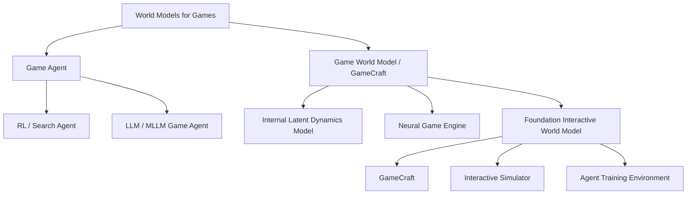

下面重新生成一版，结构尽量像前面那种：**先讲总目标，再讲三人分工，再讲每个人具体做什么、创新点、答辩内容、交付文件和时间安排**。这版会把 C 的任务重新加重，保证三个人贡献都像“核心模块负责人”，而不是一个人只是做展示。

------

# 一、项目定位

你们选的是：

**学术论文综述生成 Harness：以 World Models / GameCraft 为主题生成一篇图文并茂、引用可信、结构清晰的综述。**

但是你们不能只做：

```text
输入 World Models
调用大模型
输出一篇综述
```

这样太普通，也不符合 Harness 的考察重点。

你们应该做成：

```text
输入主题
  ↓
任务规划
  ↓
论文检索 / 论文缓存
  ↓
论文结构化 Paper Card
  ↓
领域分类 Taxonomy
  ↓
发展时间线 Timeline
  ↓
Claim-to-Evidence 证据绑定
  ↓
综述生成
  ↓
引用校验 Citation Verification
  ↓
质量评测 Survey Evaluation
  ↓
图文 HTML / PDF 输出
```

也就是说，你们的创新点不是“写得更好”，而是：

> 把综述生成变成一个可执行、可追踪、可验证、可评估、可展示的 Agentic Harness。

------

# 二、最终项目可以怎么包装

推荐项目名：

```text
EviSurvey
```

完整名称：

```text
EviSurvey: Evidence-grounded Survey Harness for World Models
```

一句话介绍：

```text
EviSurvey 是一个面向新兴科研领域的可信综述生成 Harness。它通过 Paper Card、Claim-to-Evidence Map、Citation Verifier、Survey Evaluator 和 Interactive Report，将大模型综述生成从一次性文本生成转化为可追踪、可验证、可评估的多阶段研究工作流。
```

你们可以把它和 baseline 区分开：

```text
baseline：给出一篇 World Model / GameCraft 调研结果。
我们：构建一个能自动生成、校验和评估这类调研结果的 Harness。
```

baseline 已经把主线拆成 Game Agent 和 Game World Model / GameCraft 两条，并总结了从游戏 benchmark、agent 内部 world model、neural game engine 到 foundation interactive world model 的发展脉络。你们的创新就是把这种人工综述流程系统化、模块化、可验证化。

------

# 三、三人总分工

推荐最终写成：

| 成员 | 角色                                | 负责模块                                             | 贡献 |
| ---- | ----------------------------------- | ---------------------------------------------------- | ---- |
| A    | Harness Orchestrator                | Agent Loop、Intern API、工具注册、状态管理、失败恢复 | 33%  |
| B    | Knowledge Grounding Engineer        | 论文知识库、Paper Card、分类、引用校验、证据绑定     | 34%  |
| C    | Evaluation & Visualization Engineer | 综述生成、质量评测、时间线、图谱、交互式报告         | 33%  |

这版分工更均衡。
三个人都不是“打杂”，每个人都有自己的核心技术模块。

------

# 四、成员 A：Harness 架构与 Agent Loop

## 1. A 的职责定位

A 负责整个系统的“骨架”。

也就是说，A 要保证：

```text
系统能接收用户任务
能调用 Intern-S2-Preview
能按照计划调用工具
能保存中间状态
能处理失败
能输出最终结果
```

A 是让项目看起来像 Harness 的关键。

------

## 2. A 要完成的基础任务

### 任务 A1：接入 Intern-S2-Preview API

要求：

```text
支持 API Base URL
支持 API Key
支持模型名配置
支持从环境变量读取
```

配置文件：

```text
.env
.env.example
config.py
llm_client.py
```

`.env.example` 可以写：

```bash
INTERN_API_BASE_URL=https://chat.intern-ai.org.cn/api
INTERN_API_KEY=your_api_key_here
INTERN_MODEL_NAME=intern-s2-preview
```

这样满足题目要求：评委可以换自己的 API Key 运行。

------

### 任务 A2：实现 Agent Loop

Agent Loop 负责整个任务流转。

伪流程：

```text
用户输入 topic
  ↓
Planner 生成任务计划
  ↓
Tool Registry 找到对应工具
  ↓
执行工具
  ↓
保存工具结果
  ↓
根据状态进入下一步
  ↓
全部完成后输出报告
```

核心文件：

```text
harness/agent_loop.py
harness/planner.py
harness/tool_registry.py
harness/state_manager.py
```

------

### 任务 A3：实现 Tool Registry

所有工具都要有统一接口。

例如：

```json
{
  "name": "build_paper_cards",
  "description": "Build structured paper cards from retrieved papers.",
  "input": "retrieved_papers.json",
  "output": "paper_cards.json"
}
```

这样答辩时可以说：

> 我们没有把功能写死在一个脚本里，而是把每个能力封装成工具，通过 Tool Registry 统一调度。

------

### 任务 A4：实现 State Manager

保存中间状态：

```json
{
  "topic": "World Models for GameCraft",
  "current_step": "verify_citations",
  "finished_steps": [
    "search_papers",
    "build_paper_cards",
    "classify_papers",
    "write_survey"
  ],
  "artifacts": {
    "papers": "cache/retrieved_papers.json",
    "paper_cards": "cache/paper_cards.json",
    "survey": "output/survey.md",
    "report": "output/world_model_survey.html"
  }
}
```

这样做的好处：

```text
任务中断后可以恢复
每一步结果可以检查
答辩时可以展示流程不是黑盒
```

------

### 任务 A5：失败恢复与 fallback

至少支持这些情况：

| 失败情况             | 处理方式                 |
| -------------------- | ------------------------ |
| API 调用失败         | 重试一次                 |
| 模型输出 JSON 格式错 | 要求模型重新输出         |
| 在线检索失败         | 使用 seed_papers.json    |
| 某个工具失败         | 记录错误并跳过非关键步骤 |
| HTML 渲染失败        | 至少保留 markdown 输出   |

这个是 Harness 的核心加分点之一。

------

## 3. A 的创新模块

### 创新 A1：Plan Mode

先规划，再执行。

Plan 示例：

```json
{
  "goal": "Generate a survey on World Models for GameCraft",
  "steps": [
    {
      "step_id": 1,
      "name": "search_papers",
      "tool": "search_papers",
      "status": "pending"
    },
    {
      "step_id": 2,
      "name": "build_paper_cards",
      "tool": "build_paper_cards",
      "status": "pending"
    },
    {
      "step_id": 3,
      "name": "verify_citations",
      "tool": "verify_citations",
      "status": "pending"
    }
  ]
}
```

答辩话术：

```text
我们参考 Claude Code / Codex 的 plan 模式，让模型先生成可执行计划，再由 Harness 调度工具执行，避免模型直接跳到最终写作。
```

------

### 创新 A2：Workflow Replay

每次运行保存日志：

```text
logs/run.jsonl
```

每行记录：

```json
{
  "time": "2026-xx-xx",
  "step": "citation_verification",
  "input_file": "output/survey.md",
  "output_file": "cache/verification_result.json",
  "status": "success"
}
```

答辩话术：

```text
Harness 支持 workflow replay，能够复盘每一步工具调用，方便定位幻觉来源和失败步骤。
```

------

### 创新 A3：轻量 Sandbox Guard

不一定做 Docker，只要限制文件读写路径。

```text
允许读写：
workspace/
cache/
output/
logs/

禁止读写：
系统根目录
用户其他文件
项目外路径
```

答辩话术：

```text
我们实现了轻量级文件访问控制，避免 Agent 工具调用随意读写项目外文件，体现 Harness 的安全边界设计。
```

------

## 4. A 负责的文件

```text
main.py
config.py
llm_client.py

harness/
├── agent_loop.py
├── planner.py
├── tool_registry.py
├── state_manager.py
├── logger.py
├── module_loader.py
└── sandbox_guard.py
```

------

## 5. A 答辩负责讲什么

A 讲 3 个点：

```text
1. 我们为什么是 Harness，而不是普通 prompt 工程。
2. Agent Loop、Tool Registry、State Manager 如何协同。
3. Plan Mode、Workflow Replay、Fallback 如何提升长流程稳定性。
```

A 的一句话总结：

```text
我负责把综述生成过程设计成一个可执行、可追踪、可恢复的 Agentic Harness。
```

------

# 五、成员 B：论文知识库、Paper Card 与可信引用

## 1. B 的职责定位

B 负责整个系统的“知识来源”和“可信性”。

也就是说，B 要解决：

```text
论文从哪里来？
引用是不是真的？
每个论断有没有证据？
论文怎么分类？
哪些论文是核心论文？
```

题目特别强调不能有幻觉引用，所以 B 的模块是这个项目最关键的技术亮点之一。

------

## 2. B 要完成的基础任务

### 任务 B1：整理 seed_papers.json

因为现场网络和 API 可能不稳定，所以必须有本地论文种子库。

至少覆盖这些方向：

```text
1. Game as AI Benchmark
2. Internal World Model
3. Neural Game Engine
4. Foundation Interactive Game World Model / GameCraft
5. LLM / MLLM Game Agent
6. Benchmark / Evaluation / Toolkit
```

baseline 中也正是按照这些阶段组织的，比如它把 World Models、PlaNet、Dreamer、MuZero、IRIS、DIAMOND 放在 agent 内部 world model 阶段，把 GameGAN、Genie、GameNGen、Oasis、Muse/WHAM 放在 neural game engine 阶段。

种子论文建议包括：

```text
DQN
AlphaGo
AlphaZero
AlphaStar
OpenAI Five
World Models
PlaNet
Dreamer
DreamerV3
MuZero
EfficientZero
IRIS
DIAMOND
GameGAN
Genie
GameNGen
Oasis
Muse / WHAM
Hunyuan-GameCraft
Hunyuan-GameCraft-2
Matrix-Game 2.0
Matrix-Game 3.0
Yume
HY-WorldPlay
Voyager
MineDojo
VPT
Cradle
Generative Agents
WorldMark
```

------

### 任务 B2：实现 Paper Card

每篇论文都变成结构化 JSON。

```json
{
  "paper_id": "dreamerv3_2023",
  "title": "DreamerV3: Mastering Diverse Domains through World Models",
  "authors": ["..."],
  "year": 2023,
  "venue": "arXiv",
  "url": "...",
  "category": "Internal World Model",
  "keywords": [
    "latent dynamics",
    "imagination",
    "model-based reinforcement learning"
  ],
  "problem": "What problem does this paper solve?",
  "method": "What is the core method?",
  "contribution": "What is the main contribution?",
  "limitation": "What are the limitations?",
  "evidence": [
    {
      "source": "abstract",
      "text": "..."
    }
  ]
}
```

Paper Card 是整个项目的中间核心产物。

答辩时可以说：

```text
我们不直接让模型写综述，而是先把每篇论文压缩成结构化 Paper Card，再基于 Paper Card 生成综述。
```

------

### 任务 B3：实现论文分类 Taxonomy Builder

分类建议：

```text
1. Game as AI Benchmark
2. Internal World Model for Agents
3. Neural Game Engine
4. Foundation Interactive Game World Model / GameCraft
5. LLM / MLLM Game Agent
6. Benchmark / Evaluation / Toolkit
```

分类依据：

```text
论文标题
摘要
关键词
研究目标
方法类型
应用场景
```

可以先规则分类，再让模型辅助判断。

------

### 任务 B4：实现 Citation Verifier

规则：

```text
1. 综述中每个 citation_key 必须存在于 citation_index.json
2. 参考文献只能从 paper_cards.json 自动生成
3. 不允许模型自己编造参考文献
4. 引用不存在则标记 invalid
5. 引用存在但 claim 不支持则标记 weak
```

输出：

```json
{
  "total_citations": 38,
  "valid_citations": 36,
  "invalid_citations": 2,
  "weak_claims": 4,
  "citation_validity_score": 0.947
}
```

------

### 任务 B5：实现 Claim-to-Evidence Map

这个是你们非常重要的创新点。

每个关键论断都绑定论文证据：

```json
{
  "claim_id": "claim_012",
  "claim": "Interactive world models shift the role of world models from internal planning modules to real-time controllable simulators.",
  "supporting_papers": [
    "genie_2024",
    "gamenegen_2024",
    "hunyuan_gamecraft_2025"
  ],
  "evidence_status": "supported"
}
```

这个比普通 Citation Checker 更高级。

答辩时可以强调：

```text
我们不仅检查引用是否存在，还检查综述中的关键论断是否能映射到具体论文证据。
```

------

## 3. B 的创新模块

### 创新 B1：Paper Store

所有论文进入统一知识库：

```text
cache/paper_cards.json
cache/citation_index.json
cache/paper_store.db
```

它支撑后续所有生成。

------

### 创新 B2：Claim-to-Evidence Map

把综述里的 claim 和 paper 绑定。

这个直接对应题目要求：

```text
没有幻觉引用
没有缺乏事实证据的幻觉描述
```

------

### 创新 B3：Paper Influence Score

baseline 提到，新近 arXiv 工作 citation 往往严重滞后，因此不要只按引用数判断价值。

所以你们可以设计一个综合评分：

```text
final_score =
citation_score * 0.3
+ recency_score * 0.2
+ category_importance * 0.2
+ open_source_impact * 0.2
+ benchmark_value * 0.1
```

这样新兴 GameCraft 论文不会因为引用少而被漏掉。

------

## 4. B 负责的文件

```text
tools/
├── search_papers.py
├── parse_papers.py
├── build_paper_cards.py
├── classify_papers.py
├── verify_citations.py
├── build_claim_map.py
└── paper_ranker.py

cache/
├── seed_papers.json
├── retrieved_papers.json
├── paper_cards.json
├── citation_index.json
└── claim_map.json
```

------

## 5. B 答辩负责讲什么

B 讲 3 个点：

```text
1. Paper Card 如何把论文变成结构化知识。
2. Citation Verifier 如何避免虚构引用。
3. Claim-to-Evidence Map 如何保证关键论断有证据。
```

B 的一句话总结：

```text
我负责让系统生成的综述不是模型凭空写出来的，而是 grounded on verified papers。
```

------

# 六、成员 C：综述质量评测、图文生成与交互式报告

## 1. C 的职责定位

C 不只是做 PPT 或美化。

C 负责整个系统的“结果层”和“评测层”。

也就是说，C 要解决：

```text
生成的综述结构好不好？
覆盖是否完整？
引用校验结果如何展示？
发展脉络是否清楚？
最终报告是否图文并茂？
评委能否一眼看懂你们的创新？
```

C 是让项目“出彩”的关键。

------

## 2. C 要完成的基础任务

### 任务 C1：实现 Survey Writer

输入：

```text
paper_cards.json
taxonomy.json
timeline.json
claim_map.json
```

输出：

```text
survey.md
```

综述结构：

```text
标题：From Game Agents to GameCraft: A Survey of World Models for Interactive Game Intelligence

摘要

1. 引言
2. 游戏作为通用智能 Benchmark
3. Agent 内部的 World Model
4. Neural Game Engine 的出现
5. Foundation Interactive Game World Model / GameCraft
6. LLM / MLLM Game Agent 与 World Model 融合
7. Benchmark、评测与工具生态
8. 当前挑战
9. 未来方向
10. 结论
11. 参考文献
```

baseline 的一句话总结其实可以作为你们综述主线：如果看 game agent，主线是 DQN/AlphaGo/AlphaStar 到 LLM/MLLM agents；如果看 game craft model，主线应从 World Models/PlaNet/Dreamer/MuZero 接到 Genie/GameNGen/DIAMOND，再进入 Hunyuan-GameCraft、Matrix-Game、Yume、HY-WorldPlay、Genie 3 等 interactive foundation world model。

------

### 任务 C2：实现 Survey Evaluator

这个是 C 的核心技术模块。

输入：

```text
survey.md
paper_cards.json
citation_result.json
claim_map.json
taxonomy.json
```

输出：

```json
{
  "coverage_score": 0.88,
  "citation_validity_score": 0.95,
  "evidence_grounding_score": 0.86,
  "structure_score": 0.92,
  "visualization_score": 0.90,
  "overall_score": 0.90
}
```

评测维度：

| 维度               | 评测什么                   | 实现方式                               |
| ------------------ | -------------------------- | -------------------------------------- |
| Coverage           | 是否覆盖主要阶段和代表论文 | 检查核心类别和核心论文是否出现         |
| Citation Validity  | 引用是否真实               | 使用 B 的 Citation Verifier 结果       |
| Evidence Grounding | 关键论断是否有证据         | 检查 claim_map                         |
| Structure          | 综述章节是否完整           | 检查标题结构                           |
| Visualization      | 是否包含图表和矩阵         | 检查 timeline、taxonomy、table、matrix |

这个模块很重要，因为它让 C 的工作非常技术化。

------

### 任务 C3：实现 Timeline Visualization

根据论文年份和类别自动生成时间线。

示例：

```text
2015  DQN
2016  AlphaGo
2018  World Models / AlphaZero
2019  PlaNet / AlphaStar
2020  MuZero / GameGAN
2022  VPT / MineDojo
2023  Voyager / DreamerV3
2024  Genie / GameNGen / DIAMOND
2025  Hunyuan-GameCraft / Matrix-Game / Yume
2026  Matrix-Game 3.0 / WorldMark / HY-WorldPlay
```

baseline 已经按照“起承转合”整理了阶段，C 的任务是把这个阶段脉络可视化。

------

### 任务 C4：实现 Taxonomy Graph

可以用 Mermaid 或 HTML 生成：



这个图可以放在最终报告第一页。

------

### 任务 C5：实现 Future Direction Matrix

结合论文 limitation 和 baseline 的未来方向，生成矩阵。

baseline 已经指出若干研究空白，例如评测落后于 demo、长程记忆是核心瓶颈、生成式 world model 与 RL world model 尚未完全融合、LLM agent 需要 grounding、游戏开发应用可能更早落地。

矩阵可以这样：

| 未来方向      | 当前问题                 | 可能方案                                      | 相关论文              |
| ------------- | ------------------------ | --------------------------------------------- | --------------------- |
| 标准化评测    | demo 很强但评测不足      | WorldMark / InterBench 指标                   | WorldMark             |
| 长程记忆      | 地图、物体、任务状态易崩 | 外部 memory + state tracker                   | Matrix-Game 3.0, LIVE |
| Agent 训练    | 生成世界难以作为训练环境 | reward model + simulator interface            | Genie, GameCraft      |
| LLM Grounding | 会规划但动作落地弱       | low-level controller + world model look-ahead | Voyager, Cradle       |
| 游戏开发落地  | 视频难变可玩原型         | interactive editing + level generation        | Muse, GameCraft       |

------

### 任务 C6：实现 Interactive HTML Report

最终报告不要只是 Markdown。

C 可以做一个静态 HTML：

```text
左侧：目录导航
中间：综述正文
右侧：Evidence Panel
顶部：质量评分
正文：时间线、分类树、论文对比表、未来方向矩阵
底部：参考文献和引用校验结果
```

Evidence Panel 示例：

```text
Current paragraph evidence:
✓ World Models, 2018
✓ PlaNet, 2019
✓ DreamerV3, 2023

Citation status:
Verified
```

这个展示效果会比普通 PDF 好很多。

------

## 3. C 的创新模块

### 创新 C1：Survey Quality Evaluator

这个是 C 的核心创新。

它让你们可以说：

```text
我们的 Harness 不仅能生成综述，还能自动评估综述质量。
```

------

### 创新 C2：Interactive Evidence Report

把 B 的 Citation Verifier 和 Claim Map 可视化。

这让可信性变成可见的东西。

------

### 创新 C3：Timeline + Taxonomy + Future Matrix

这个让综述“图文并茂”，符合题目要求。

------

## 4. C 负责的文件

```text
tools/
├── write_survey.py
├── evaluate_survey.py
├── build_timeline.py
├── build_taxonomy_graph.py
├── build_comparison_table.py
├── build_future_matrix.py
└── render_report.py

templates/
└── report.html

output/
├── survey.md
├── world_model_survey.html
├── world_model_survey.pdf
└── evaluation_report.json
```

------

## 5. C 答辩负责讲什么

C 讲 3 个点：

```text
1. 我们如何评估生成综述的质量。
2. 时间线、分类图、未来方向矩阵如何帮助理解领域。
3. Interactive Report 如何展示 evidence 和 citation status。
```

C 的一句话总结：

```text
我负责让最终综述不仅可读，而且可评估、可解释、可交互展示。
```

------

# 七、加分项模块化设计

你们可以把加分项做成插件式模块。

目录：

```text
modules/
├── skill_system/
├── memory_system/
├── citation_verifier/
├── evidence_mapper/
├── survey_evaluator/
├── workflow_replay/
├── sandbox_guard/
└── paper_ranker/
```

------

## 加分项 1：Skill System

负责人建议：A 主导，B/C 提供 skill 内容。

目录：

```text
skills/
├── survey_writing.md
├── citation_verification.md
├── taxonomy_building.md
└── evaluation.md
```

每个 skill 写：

```text
什么时候使用
输入格式
执行步骤
输出格式
禁止事项
```

例如 `citation_verification.md`：

```markdown
# Citation Verification Skill

## When to use
在综述生成后进行引用校验时使用。

## Rules
1. 不允许生成 paper store 中不存在的引用。
2. 每个 citation_key 必须能在 citation_index.json 中找到。
3. 每个关键 claim 必须至少绑定一个 supporting paper。
4. 无证据 claim 必须标记为 weak 或删除。
```

答辩话术：

```text
我们采用 Progressive Skill Loading，不同阶段加载不同 skill，避免一次性塞入过长提示词。
```

------

## 加分项 2：Memory / Cache

负责人建议：A + B。

目录：

```text
memory/
├── project.md
├── paper_cache.json
├── failed_cases.md
└── writing_preferences.md
```

作用：

```text
缓存检索过的论文
缓存生成过的 Paper Card
记录 citation verifier 发现的错误
记录用户偏好的综述结构
```

答辩话术：

```text
Harness 可以复用历史论文缓存，并记录失败案例，实现轻量 self-improvement。
```

------

## 加分项 3：Citation Verifier

负责人建议：B。

这个是必做级别加分项。

输入：

```text
survey.md
citation_index.json
paper_cards.json
```

输出：

```text
citation_result.json
```

------

## 加分项 4：Survey Evaluator

负责人建议：C。

输入：

```text
survey.md
paper_cards.json
claim_map.json
citation_result.json
```

输出：

```text
evaluation_report.json
```

------

## 加分项 5：Workflow Replay

负责人建议：A。

作用：

```text
记录每一步输入输出
支持答辩时展示完整运行轨迹
帮助定位错误
```

------

# 八、完整项目目录

建议最后项目结构如下：

```text
evisurvey/
├── README.md
├── requirements.txt
├── .env.example
├── main.py
├── config.py
├── llm_client.py
│
├── harness/
│   ├── agent_loop.py
│   ├── planner.py
│   ├── tool_registry.py
│   ├── state_manager.py
│   ├── logger.py
│   ├── module_loader.py
│   └── sandbox_guard.py
│
├── tools/
│   ├── search_papers.py
│   ├── parse_papers.py
│   ├── build_paper_cards.py
│   ├── classify_papers.py
│   ├── build_claim_map.py
│   ├── verify_citations.py
│   ├── paper_ranker.py
│   ├── write_survey.py
│   ├── evaluate_survey.py
│   ├── build_timeline.py
│   ├── build_taxonomy_graph.py
│   ├── build_comparison_table.py
│   ├── build_future_matrix.py
│   └── render_report.py
│
├── skills/
│   ├── survey_writing.md
│   ├── citation_verification.md
│   ├── taxonomy_building.md
│   └── evaluation.md
│
├── memory/
│   ├── project.md
│   ├── paper_cache.json
│   ├── failed_cases.md
│   └── writing_preferences.md
│
├── cache/
│   ├── seed_papers.json
│   ├── retrieved_papers.json
│   ├── paper_cards.json
│   ├── citation_index.json
│   ├── taxonomy.json
│   ├── timeline.json
│   └── claim_map.json
│
├── templates/
│   └── report.html
│
├── output/
│   ├── survey.md
│   ├── world_model_survey.html
│   ├── world_model_survey.pdf
│   ├── evaluation_report.json
│   └── citation_result.json
│
└── logs/
    └── run.jsonl
```

------

# 九、24 小时开发安排

## 第 0～2 小时：确定接口和项目骨架

三个人一起完成：

```text
1. 确定项目名 EviSurvey
2. 确定目录结构
3. 确定所有中间 JSON 格式
4. 确定每个工具输入输出
5. 确定最终报告结构
```

这个阶段最重要的是统一接口。

------

## 第 2～6 小时：并行开发基础模块

A：

```text
接 Intern API
写 main.py
写 agent_loop.py
写 tool_registry.py
写 state_manager.py
```

B：

```text
整理 seed_papers.json
写 build_paper_cards.py
写 classify_papers.py
```

C：

```text
写 report.html 模板
写 build_timeline.py
写 build_taxonomy_graph.py
写 write_survey.py 初版
```

------

## 第 6～12 小时：打通主流程

目标：

```text
python main.py --topic "World Models for GameCraft"
```

能够生成：

```text
cache/paper_cards.json
cache/taxonomy.json
cache/timeline.json
output/survey.md
output/world_model_survey.html
```

这个阶段先不要追求完美，先跑通。

------

## 第 12～18 小时：加入创新模块

A：

```text
Plan Mode
Workflow Replay
Fallback
```

B：

```text
Citation Verifier
Claim-to-Evidence Map
Paper Influence Score
```

C：

```text
Survey Evaluator
Interactive Evidence Panel
Future Direction Matrix
HTML 美化
```

------

## 第 18～22 小时：结果打磨和答辩材料

共同完成：

```text
1. 生成最终报告
2. 检查引用
3. 生成 evaluation_report.json
4. 准备 PPT
5. 准备 Demo 脚本
6. 准备每个人答辩讲稿
```

------

## 第 22～24 小时：兜底和演练

检查：

```text
1. README 是否能跑
2. API Key 是否可替换
3. 输出文件是否存在
4. Demo 是否能离线跑
5. 每个人是否知道自己讲什么
6. 代码是否有明显报错
```

------

# 十、每个人答辩怎么分配

假设答辩 10 分钟。

## 第 1 分钟：共同开场

可以由组长讲：

```text
我们做的是 EviSurvey，一个面向 World Models / GameCraft 领域的 evidence-grounded 学术综述生成 Harness。它不是直接调用大模型写文章，而是把综述生成拆成任务规划、论文结构化、证据绑定、引用校验、质量评测和交互式报告生成等多个可执行模块。
```

------

## 第 2～4 分钟：A 讲 Harness 架构

A 讲：

```text
1. Agent Loop
2. Tool Registry
3. State Manager
4. Plan Mode
5. Workflow Replay
6. Fallback
```

重点句：

```text
我们的创新是把长流程综述任务从一次性生成，转化为可调度、可恢复、可复盘的工具调用工作流。
```

------

## 第 4～7 分钟：B 讲可信知识库

B 讲：

```text
1. Paper Store
2. Paper Card
3. Taxonomy Builder
4. Citation Verifier
5. Claim-to-Evidence Map
```

重点句：

```text
我们不允许模型自由生成参考文献。所有引用必须来自 Paper Store，所有关键论断必须能映射到 supporting papers。
```

------

## 第 7～9 分钟：C 讲评测与可视化

C 讲：

```text
1. Survey Evaluator
2. Timeline
3. Taxonomy Graph
4. Future Direction Matrix
5. Interactive Evidence Report
```

重点句：

```text
我们不仅生成综述，还生成 evaluation report，并把 citation status 和 supporting evidence 可视化展示出来。
```

------

## 第 9～10 分钟：共同总结

三个人各一句：

```text
A：我负责让系统流程可执行、可追踪、可恢复。
B：我负责让综述内容可验证、有证据、不幻觉。
C：我负责让结果可评估、可解释、可交互展示。
```

------

# 十一、最终交付清单

你们最终至少交：

```text
1. 源代码
2. README.md
3. requirements.txt
4. .env.example
5. seed_papers.json
6. paper_cards.json
7. claim_map.json
8. citation_result.json
9. evaluation_report.json
10. world_model_survey.html
11. world_model_survey.pdf
12. Demo PPT
13. Intern-S2-Preview 能力不足分析表
14. 团队分工说明
```

README 运行方式：

```bash
pip install -r requirements.txt
cp .env.example .env
python main.py --topic "World Models for GameCraft" --mode full
```

兜底运行方式：

```bash
python main.py --topic "World Models for GameCraft" --mode demo --use-cache
```

------

# 十二、Intern-S2-Preview 能力不足分析表

这个是交付要求，别忘了。

可以写：

| 维度         | 观察到的问题               | 对任务影响      | Harness 应对               |
| ------------ | -------------------------- | --------------- | -------------------------- |
| 长上下文     | 多篇论文同时输入时容易遗漏 | 综述覆盖不完整  | 先压缩成 Paper Card        |
| 引用真实性   | 可能生成不存在的引用       | 学术可信度下降  | Citation Verifier          |
| 论断证据     | 有时会生成无证据总结       | 产生幻觉描述    | Claim-to-Evidence Map      |
| 工具调用格式 | JSON 输出偶尔不稳定        | Agent Loop 中断 | Schema 校验与重试          |
| 领域分类     | 相近论文类别容易混淆       | taxonomy 不稳定 | 规则分类 + 模型复核        |
| 长流程一致性 | 多阶段任务容易忘记目标     | 输出偏离主题    | State Manager 保存任务状态 |
| 图文排版     | 直接生成美观报告能力有限   | 输出观感一般    | HTML 模板统一渲染          |

------

# 十三、最推荐你们实际完成的版本

你们 24 小时内最应该保住的是：

```text
1. Agent Loop
2. Paper Card
3. Citation Verifier
4. Claim-to-Evidence Map
5. Survey Evaluator
6. Timeline / Taxonomy Graph
7. Interactive HTML Report
```

这 7 个做出来，就已经比普通 baseline 明显更像 Harness，也更有创新点。

有时间再做：

```text
1. Skill System
2. Memory / Cache
3. Paper Influence Score
4. Workflow Replay
5. Sandbox Guard
```

------

# 十四、最终版本一句话

你们最后可以这样总结：

```text
EviSurvey 将 World Models 综述生成拆解为可执行、可验证、可评估的多阶段 Harness：A 负责 Agent Loop 和工具编排，B 负责 Paper Store、Citation Verifier 和 Claim-to-Evidence，C 负责 Survey Evaluator、时间线图谱和交互式报告。相比 baseline，我们的创新不只是生成一篇综述，而是构建了一套可复用的可信学术综述生成工作流。
```

这个版本里，**C 的任务已经不是少量包装工作，而是完整负责“质量评测 + 可视化 + 交互报告”模块**，和 A/B 的技术重量基本平衡。